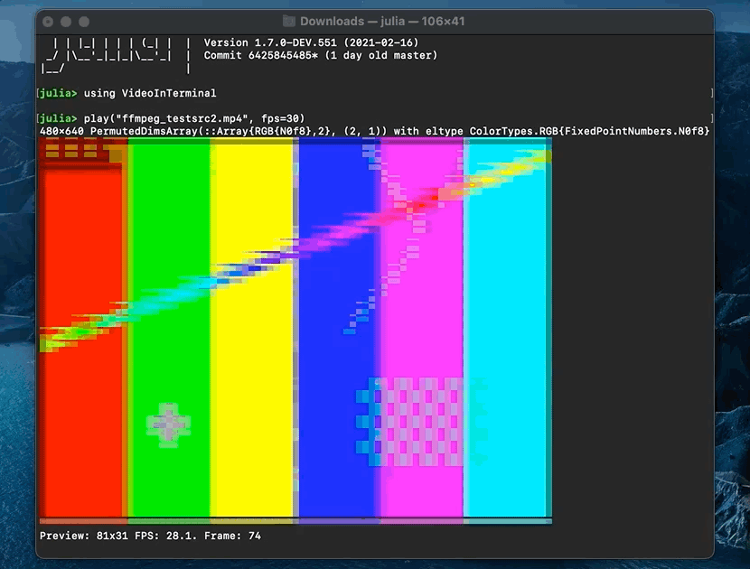
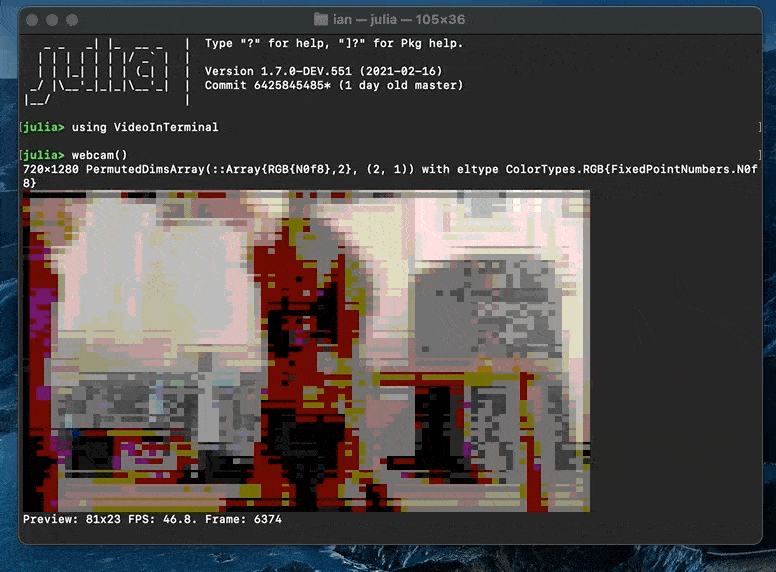

# VideoInTerminal.jl
 Video playback in terminal via. ImageInTerminal.jl and VideoIO.jl

Experimental! Owes a lot to ImageInTerminal!

## Usage

```julia
julia> using VideoInTerminal

julia> framestack = map(i->rand(Gray{N0f8},60,40), 1:200); # a vector of images of the same type and dims

julia> play(framestack)
```
kwargs:
- `fps::Real`: play the framestack back at a target fps (default 30)
- `maxsize::Tuple`: specify a max video size in terminal characters. Default is determined automatically

Control keys:
- `p`: pause
- `o`: step backward (in framestack mode)
- `[`: step forward (in framestack mode)
- `ctrl-c`: exit


Play a video from a path
```julia
julia> play("path/to/video.mp4")
```


View the default webcam
```julia
julia> webcam()
```


[VideoIO's test videos](https://juliaio.github.io/VideoIO.jl/stable/utilities/#Test-Videos) can also be accessed by name,
which will be automatically downloaded
```julia
julia> testvideo("annie_oakley")
```
## Tips

1) Exit the video with an interrupt via. `ctrl-c`

2) If video playback isn't reaching the desired fps, try stopping the video and reduce the size of your
   terminal, or specify the `maxsize` kwarg as a tuple of width and height in terminal characters.

   If it's still slow, the internal downscaling in ImageInTerminal may be the limiting factor

3) `ImageInTerminal` is exported, so color depth settings can be controlled as per [the manual](https://github.com/JuliaImages/ImageInTerminal.jl#256-colors-and-24-bit-colors)
