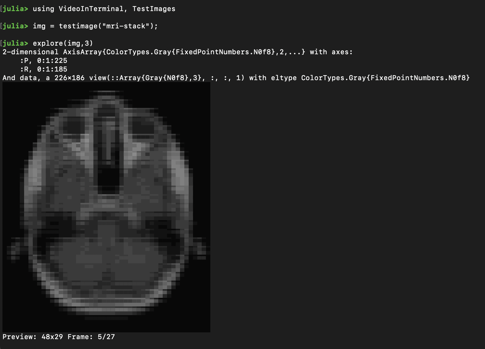

# VideoInTerminal.jl
 Video playback in terminal via. [ImageInTerminal.jl](https://github.com/JuliaImages/ImageInTerminal.jl)
 and [VideoIO.jl](https://github.com/JuliaIO/VideoIO.jl)

Experimental! Owes a lot to ImageInTerminal!

## Usage

### Play

```julia
julia> using VideoInTerminal

julia> framestack = map(i->rand(Gray{N0f8},60,40), 1:200); # a vector of images of the same type and dims

julia> play(framestack) # play through the framestack

julia> colorcube = rand(Gray{N0f8},60,40,30);

julia> play(colorcube, 2) # play slices along dim 2

julia> play("path/to/video.mp4")
```


kwargs:
- `fps::Real`: play the framestack back at a target fps (default 30)
- `maxsize::Tuple`: specify a max video size in terminal characters. Default is determined from terminal window size

### Control keys:
- `p` or `space-bar`: pause
- `left-` or `up-arrow`: step backward (in framestack mode)
- `right-` or `down-arrow`: step forward (in framestack mode)
- `ctrl-c` or `q`: exit

### Explore

`explore` methods mimic `play` methods except starting paused.

Control keys enable stepping through the selected dimension
```julia
julia> using VideoInTerminal, TestImages

julia> img = testimage("mri-stack");

julia> explore(img, 3) # explore img along the 3rd dimension, use arrow keys to move
```


### Camera Streaming

View the primary system camera
```julia
julia> showcam()
```


or choose another capture device:
```julia
julia> VideoIO.init_camera_devices()

julia> VideoIO.init_camera_settings()

julia> devs = VideoInTerminal.VideoIO.CAMERA_DEVICES
2-element Vector{String}:
 "FaceTime HD Camera (Built-in)"
 "Capture screen 0"

julia> showcam(device=devs[2])
```

### Test videos

[VideoIO's test videos](https://juliaio.github.io/VideoIO.jl/stable/utilities/#Test-Videos) can also be accessed by name,
which will be automatically downloaded
```julia
julia> testvideo("annie_oakley")
```
## Tips

1) Exit the video with an interrupt via. `ctrl-c`

2) If video playback isn't reaching the desired fps, try stopping the video and reduce the size of your
   terminal, or specify the `maxsize` kwarg as a tuple of width and height in terminal characters.

   If it's still slow, the internal downscaling in ImageInTerminal may be the limiting factor

3) `ImageInTerminal` is exported, so color depth settings can be controlled as per [the manual](https://github.com/JuliaImages/ImageInTerminal.jl#256-colors-and-24-bit-colors)
